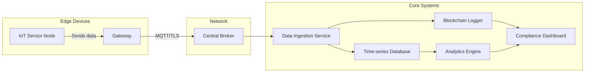

# Northland ALX – Task Deliverables

*Format: Markdown (Sublime-friendly) for easy saving and editing.*

---

## 1. Draft: IoT Compliance Module Architecture



**Components:**

* **Sensor Nodes (A):** RFID, weight, purity, location sensors attached to gold shipments.
* **Gateway (B):** Edge compute for local aggregation, buffering, and secure MQTT forwarding.
* **Central Broker (C):** Scalable MQTT broker with TLS encryption.
* **Ingestion Service (D):** Validates, transforms, and routes data to storage and blockchain.
* **Time-series DB (E):** InfluxDB/TimescaleDB for sensor metrics.
* **Blockchain Logger (F):** Hyperledger Fabric smart contract for immutable audit.
* **Analytics Engine (G):** ML models for anomaly detection and compliance scoring.
* **Dashboard (H):** Real-time web UI for compliance officers.

---

## 2. Prototype: School Placement Algorithm (Python)

```python
# northland_school_placement.py
import pandas as pd
from sklearn.metrics.pairwise import cosine_similarity

# Load student and school data
students = pd.read_csv('students.csv')
schools = pd.read_csv('schools.csv')

# Compute match score based on preferences and vacancies
def compute_match(student, school):
    score = 0
    # merit flag
    score += student['aggregate_score'] / 100
    # proximity bonus
    score += (1 - student['distance_to_school'] / 100)
    # program preference
    score += 1 if school['program'] in student['preferences'].split(',') else 0
    return score

# Build matching
assignments = []
for _, student in students.iterrows():
    # rank schools by score with vacancies
    viable = schools[schools.vacancies > 0]
    viable['score'] = viable.apply(lambda s: compute_match(student, s), axis=1)
    best = viable.sort_values('score', ascending=False).iloc[0]
    assignments.append({'student': student.id, 'school': best.id})
    # decrement vacancy
    schools.loc[schools.id == best.id, 'vacancies'] -= 1

# Save assignments
pd.DataFrame(assignments).to_csv('assignments.csv', index=False)
```

*Usage:* Adjust scoring weights and include government quotas or special cases as needed.

---

## 3. Create: Twitter Thread Introducing New Offerings

```markdown
1/ 🚀 Introducing Northland ALX’s expanded vision! We’re not just an IT consultancy—we're building Africa’s digital backbone:

2/ 📡 **IoT & Blockchain Gold Compliance**: Real-time tracking and immutable logging to guarantee traceability from mine to market.

3/ 🌱 **Agri & Cocoa Traceability**: Sensor-based dashboards ensuring product quality and origin transparency.

4/ 🏫 **Centralized School Placement**: An algorithmic portal matching students to any vacancy—so no qualified applicant is left behind.

5/ 📦 **Warehouse Marketplace**: The "Amazon of Warehouses"—dynamic bookings, AI-driven capacity forecasts, and bonded storage access.

6/ ✉️ **Email‑to‑Email Transfers**: Decentralized, secure P2P money transfers without banking rails.

7/ 💾 **Local Data Centers & ML**: On‑prem compute running our models for compliance, placement, and logistics—powered by you.

8/ 🌍 Made in Ghana, built for Africa, scaling globally. Follow us at @NorthlandALX and join the transformation! #AfroTech #GovTech #EduTech #FinTech #IoT
```

---

## 4. Design: UI Elements for Warehouse Marketplace

### 4.1 Dashboard Wireframe

```plaintext
+-----------------------------------------------------+
| Northland ALX WarehouseX Dashboard                 |
+-----------------------------------------------------+
| [Search Facility] [Filter: Region | Capacity | Rate]|
+-----------------------------------------------------+
| | Map View (interactive)                           | |
| | (Pins show available warehouses)                | |
+-----------------------------------------------------+
| List View:                                          |
| 1. Accra Central - Vacancies: 120 - Rate: $2/m²     |
| 2. Tema Port - Vacancies: 200 - Rate: $1.80/m²      |
| ...                                                 |
+-----------------------------------------------------+
| [Book Now] [Compare] [Details]                       |
+-----------------------------------------------------+
```

### 4.2 Key UI Components

* **Header:** Logo + navigation (Dashboard, Listings, Analytics, Profile)
* **Search Bar:** Live facility search with auto-complete
* **Filters Panel:** Multi-select: Region, Capacity Range, Bonded/Free-zone, Pricing
* **Map & List Sync:** Click map pin highlights list item and vice versa
* **Listing Cards:** Facility name, vacancy count, price, rating, action buttons
* **Booking Modal:** Date picker, duration selector, cost estimate
* **Analytics View:** Charts showing occupancy trends, demand forecasts

---

*Save this file in your `northland-alx-brand-kit/docs/` folder as `task_deliverables.md`.*
